# Pruebas funcionales manuales — API de notificaciones

**Base URL usada en esta ronda:** `http://127.0.0.1:3001` (puerto según `PUERTO` en `.env`).  
**Fecha de ejecución (evidencia reproducible):** 2026-04-15.

---

## Evidencia: ¿bastan request y response?

Sí, **en muchas rúbricas** basta documentar de forma trazable:

- método y URL, cabeceras relevantes, cuerpo de la petición;
- código HTTP, cuerpo de la respuesta (JSON).

Eso es equivalente a exportar una colección de Postman o un informe técnico. **Si el docente pide explícitamente capturas de pantalla** (Postman, navegador, Mongo Compass), añade imágenes en una carpeta del repo (por ejemplo `docs/evidencias/`) y enlázalas en la columna **Evidencia** de la tabla.

### Evidencia en un solo documento

**Todo** lo de esta entrega de pruebas está en **este archivo**:

| Contenido | Dónde |
|-----------|--------|
| Tipos de prueba (manual) | [§3](#3-tipos-de-pruebas-funcionales-manual) |
| Tabla de casos + `curl` | [§4](#4-casos-de-prueba-funcionales) |
| Request/response JSON | [Anexo A](#anexo-a--request--response-evidencia-textual) (A.1–A.11) |
| **Capturas Postman** (CP-1 a CP-11) | Debajo de cada **Anexo A.n** (figura embebida; CP-11 con tres capturas en A.11) |
| **CP-11** (3 capturas, secuencia) | [Anexo A.11](#anexo-a11--cp-11-navegación-secuencia-postman) |
| **Lámina resumen** generada | [Anexo B](#anexo-b) |
| Incidencias y análisis | [§5](#5-registro-de-incidencias-errores-detectados) y [§6](#6-análisis-de-resultados) |

Los PNG siguen en la carpeta `docs/evidencias/` solo como archivos; la **documentación** vive aquí. Las figuras usan ruta **`./evidencias/...`** (relativa a este `.md`) para que el **preview de Markdown** en el editor resuelva bien las imágenes; en GitHub el render es el mismo.

**Versión Word (imágenes incrustadas):** en el mismo directorio existe **`PRUEBAS_FUNCIONALES.docx`**, generado desde este Markdown con las capturas embebidas. Para regenerarlo tras cambiar texto o PNG: `npm install` y luego `npm run doc:pruebas`.

---

## 3. Tipos de pruebas funcionales (manual)

Las siguientes categorías se ejecutan **sin herramientas de automatización obligatorias** (Postman, `curl`, navegador o cliente HTTP a mano), interactuando con la API expuesta.

| Tipo | Aplicación en este sistema |
|------|----------------------------|
| **Flujo normal** | Envío de notificación con datos válidos (cuerpo libre, desde plantilla o recordatorio de matrícula) y obtención de respuesta **202** coherente. |
| **Validación de datos** | Peticiones con JSON incompleto o inválido: faltan `destinatario` / `asunto`, `variables` que no es objeto, `idPlantilla` inexistente, etc. Se espera **400** o **404** según el caso. |
| **Escenario alternativo** | Recordatorio sin `destinatario` en el cuerpo (usa Mongo / `.env` / valor por defecto); plantilla con variables parciales; listar plantillas sin enviar correo. |
| **Manejo de errores** | Plantilla inexistente (**404**); fallo de conexión Mongo o SMTP (según entorno, **500** o rechazo en consola); `GET /plantillas-correo/:id` con id desconocido. |
| **Persistencia** | Tras migraciones, comprobar en Mongo colecciones `plantillas_correo` y `destinatarios_prueba`; `GET /plantillas-correo` y `GET /plantillas-correo/:id` reflejan datos almacenados. |
| **Navegación / recursos** | Recorrer distintos recursos HTTP (`/salud`, plantillas, notificaciones) en secuencia sin reiniciar el servidor; verificar que no se pierde el estado del servicio entre peticiones. |

---

## 4. Casos de prueba funcionales

### Resumen ejecutado (servidor `localhost:3001`)

| ID | Funcionalidad | Descripción | Resultado esperado | Resultado obtenido | Estado | Evidencia |
|----|---------------|-------------|---------------------|-------------------|--------|-----------|
| 1 | Salud del servicio | API y Mongo | **200**, JSON `estado` + `mongo` | **200**, `mongo.modo: mongodb`, `conectado: true` | OK | [§A.1 + figura](#anexo-a1--cp-1-salud) · [§B](#anexo-b) |
| 2 | Notificación — flujo normal | Cuerpo libre válido | **202** | **202**, mensaje de aceptación | OK | [§A.2 + figura](#anexo-a2--cp-2-notificación-libre) · [§B](#anexo-b) |
| 3 | Notificación — validación | Sin `asunto` | **400** | **400**, detalle de campos obligatorios | OK | [§A.3 + figura](#anexo-a3--cp-3-validación) · [§B](#anexo-b) |
| 4 | Desde plantilla — flujo normal | Plantilla **presente en Mongo** (`recordatorio_matricula`) | **202** | **202**, envío por plantilla | OK | [§A.4 + figura](#anexo-a4--cp-4-desde-plantilla-existe-en-bd) · [§B](#anexo-b) |
| 5 | Desde plantilla — validación | `variables` no es objeto | **400** | **400**, variables deben ser objeto | OK | [§A.5 + figura](#anexo-a5--cp-5-variables-inválidas) · [§B](#anexo-b) |
| 6 | Desde plantilla — error | `idPlantilla` inexistente | **404** | **404**, plantilla no encontrada | OK | [§A.6 + figura](#anexo-a6--cp-6-plantilla-inexistente) · [§B](#anexo-b) |
| 7 | Recordatorio matrícula | Prototipo | **202** + datos resueltos | **202**, `destinatario` e `idPlantilla` en JSON | OK | [§A.7 Postman + bandeja](#anexo-a7--cp-7-recordatorio-matrícula) · [§B](#anexo-b) |
| 8 | Plantillas — listado | Catálogo desde Mongo | **200**, arreglo `plantillas` | **200**, lista con `recordatorio_matricula` | OK | [§A.8 + figura](#anexo-a8--cp-8-listar-plantillas) · [§B](#anexo-b) |
| 9 | Plantillas — detalle | Definición con marcadores + HTML | **200**, objeto `plantilla` | **200**, incluye `cuerpoHtmlMarcadores` | OK | [§A.9 + figura](#anexo-a9--cp-9-detalle-plantilla-truncado) · [§B](#anexo-b) |
| 10 | Plantillas — error | Id desconocido | **404** | **404** | OK | [§A.10 + figura](#anexo-a10--cp-10-plantilla-get-inexistente) · [§B](#anexo-b) |
| 11 | Navegación | Secuencia sin reiniciar servidor | Todas responden | `GET /salud` → `GET /plantillas-correo` → `POST /recordatorio-matricula` | OK | [§A.11 (3 figuras)](#anexo-a11--cp-11-navegación-secuencia-postman) · [§B](#anexo-b) |

**Nota (entorno Mongo):** si la base solo tiene migradas las plantillas del prototipo, un `idPlantilla` como `bienvenida` (solo en memoria cuando `MONGODB_MOCK=true`) puede responder **404**; el caso 4 documentado usa `recordatorio_matricula`, alineado con la BD migrada.

### Comandos `curl` de referencia (puerto 3001)

Sustituye `3001` por tu `PUERTO` si difiere.

**CP-1 — Salud**

```bash
curl -sS -w "\nHTTP:%{http_code}\n" http://127.0.0.1:3001/salud
```

**CP-2 — Notificación flujo normal**

```bash
curl -sS -w "\nHTTP:%{http_code}\n" -X POST http://127.0.0.1:3001/notificaciones \
  -H "Content-Type: application/json" \
  -d '{"destinatario":"prueba@ejemplo.com","asunto":"Asunto prueba","cuerpo":"Cuerpo de prueba"}'
```

**CP-3 — Validación (falta asunto)**

```bash
curl -sS -w "\nHTTP:%{http_code}\n" -X POST http://127.0.0.1:3001/notificaciones \
  -H "Content-Type: application/json" \
  -d '{"destinatario":"prueba@ejemplo.com","cuerpo":"Sin asunto"}'
```

**CP-4 — Desde plantilla (plantilla existente en Mongo migrada)**

```bash
curl -sS -w "\nHTTP:%{http_code}\n" -X POST http://127.0.0.1:3001/notificaciones/desde-plantilla \
  -H "Content-Type: application/json" \
  -d '{"destinatario":"prueba@ejemplo.com","idPlantilla":"recordatorio_matricula","variables":{"nombre":"Ana","plazo":"el viernes"}}'
```

**CP-5 — `variables` inválido**

```bash
curl -sS -w "\nHTTP:%{http_code}\n" -X POST http://127.0.0.1:3001/notificaciones/desde-plantilla \
  -H "Content-Type: application/json" \
  -d '{"destinatario":"prueba@ejemplo.com","idPlantilla":"recordatorio_matricula","variables":"no-es-objeto"}'
```

**CP-6 — Plantilla inexistente (POST)**

```bash
curl -sS -w "\nHTTP:%{http_code}\n" -X POST http://127.0.0.1:3001/notificaciones/desde-plantilla \
  -H "Content-Type: application/json" \
  -d '{"destinatario":"prueba@ejemplo.com","idPlantilla":"no_existe_xyz","variables":{}}'
```

**CP-7 — Recordatorio matrícula**

```bash
curl -sS -w "\nHTTP:%{http_code}\n" -X POST http://127.0.0.1:3001/notificaciones/recordatorio-matricula \
  -H "Content-Type: application/json" \
  -d '{"nombre":"Johana","plazo":"esta semana"}'
```

**CP-8 / CP-9 / CP-1 / CP-10**

```bash
curl -sS -w "\nHTTP:%{http_code}\n" http://127.0.0.1:3001/salud
curl -sS -w "\nHTTP:%{http_code}\n" http://127.0.0.1:3001/plantillas-correo
curl -sS -w "\nHTTP:%{http_code}\n" http://127.0.0.1:3001/plantillas-correo/recordatorio_matricula
curl -sS -w "\nHTTP:%{http_code}\n" http://127.0.0.1:3001/plantillas-correo/inexistente
```

---

## Anexo A — Request / response (evidencia textual)

### Anexo A.1 — CP-1 Salud

**Request**

```http
GET http://127.0.0.1:3001/salud
```

**Response** `HTTP 200`

```json
{"estado":"en marcha","mongo":{"conectado":true,"modo":"mongodb"}}
```

#### Captura Postman (CP-1)

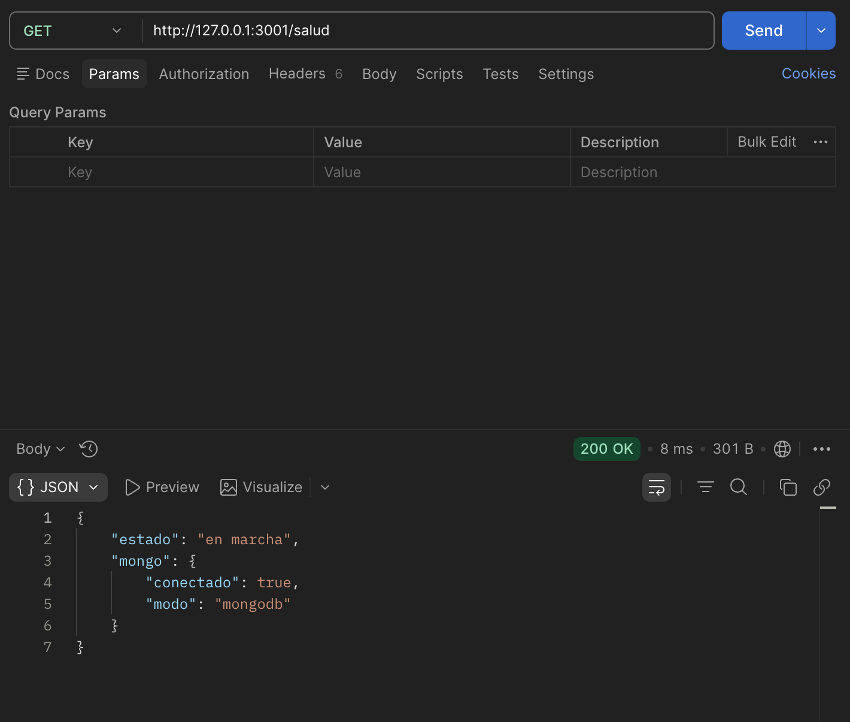

### Anexo A.2 — CP-2 Notificación libre

**Request**

```http
POST http://127.0.0.1:3001/notificaciones
Content-Type: application/json

{"destinatario":"prueba@ejemplo.com","asunto":"Asunto prueba","cuerpo":"Cuerpo de prueba"}
```

**Response** `HTTP 202`

```json
{"mensaje":"Notificación aceptada para envío."}
```

#### Captura Postman (CP-2)

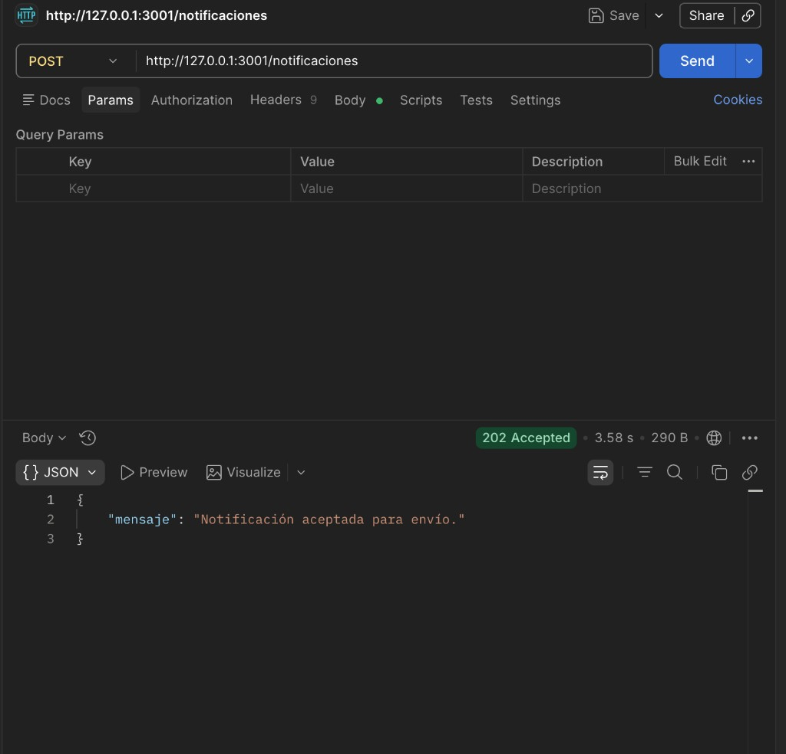

### Anexo A.3 — CP-3 Validación

**Request**

```http
POST http://127.0.0.1:3001/notificaciones
Content-Type: application/json

{"destinatario":"prueba@ejemplo.com","cuerpo":"Sin asunto"}
```

**Response** `HTTP 400`

```json
{"error":"Solicitud inválida","detalle":"Los campos destinatario y asunto son obligatorios."}
```

#### Captura Postman (CP-3)

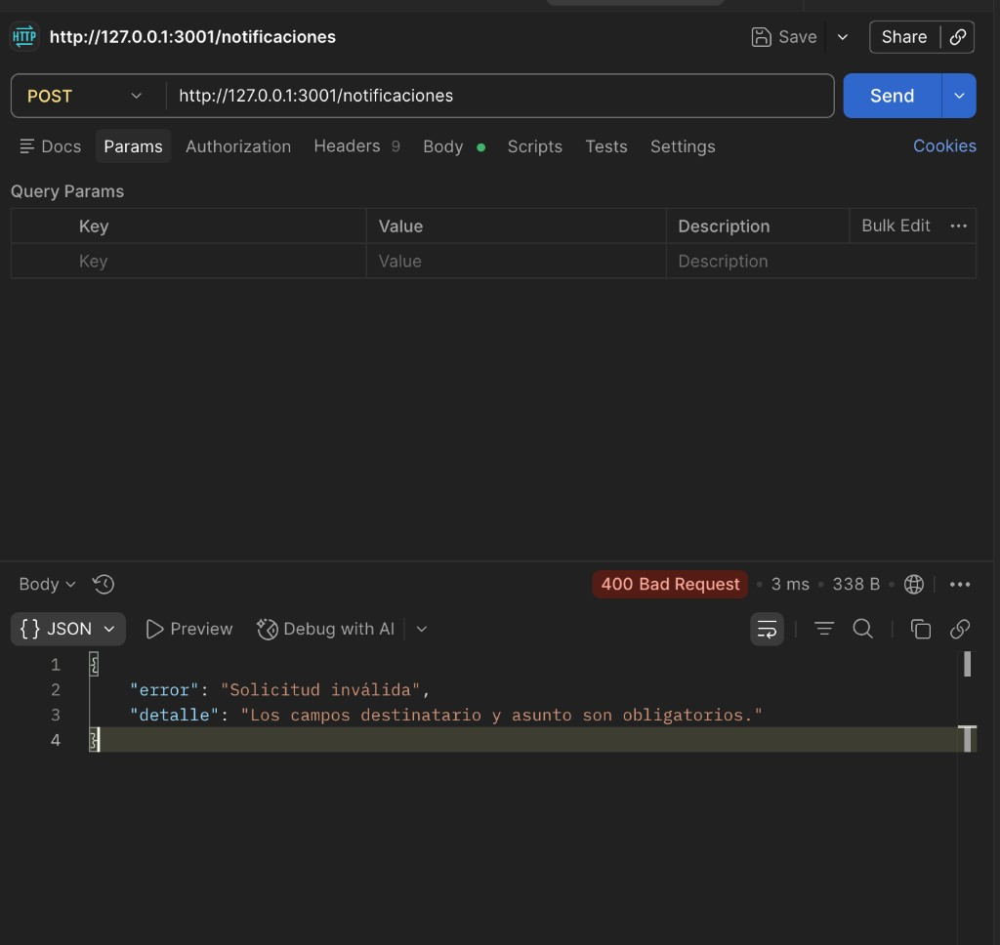

### Anexo A.4 — CP-4 Desde plantilla (existe en BD)

**Request**

```http
POST http://127.0.0.1:3001/notificaciones/desde-plantilla
Content-Type: application/json

{"destinatario":"prueba@ejemplo.com","idPlantilla":"recordatorio_matricula","variables":{"nombre":"Ana","plazo":"el viernes"}}
```

**Response** `HTTP 202`

```json
{"mensaje":"Notificación aceptada para envío (plantilla)."}
```

#### Captura Postman (CP-4)

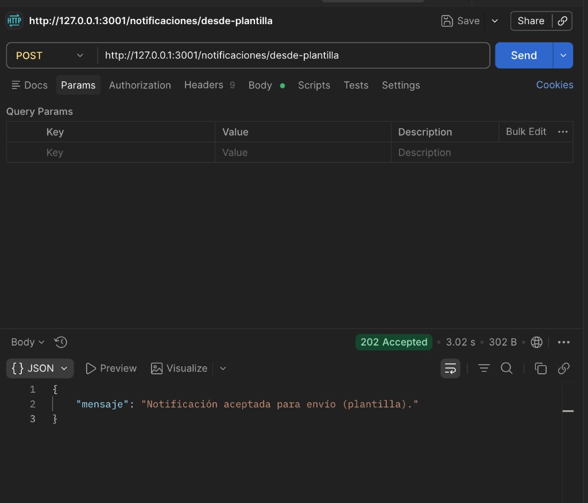

### Anexo A.5 — CP-5 Variables inválidas

**Request**

```http
POST http://127.0.0.1:3001/notificaciones/desde-plantilla
Content-Type: application/json

{"destinatario":"prueba@ejemplo.com","idPlantilla":"recordatorio_matricula","variables":"no-es-objeto"}
```

**Response** `HTTP 400`

```json
{"error":"Solicitud inválida","detalle":"El campo variables debe ser un objeto."}
```

#### Captura Postman (CP-5)

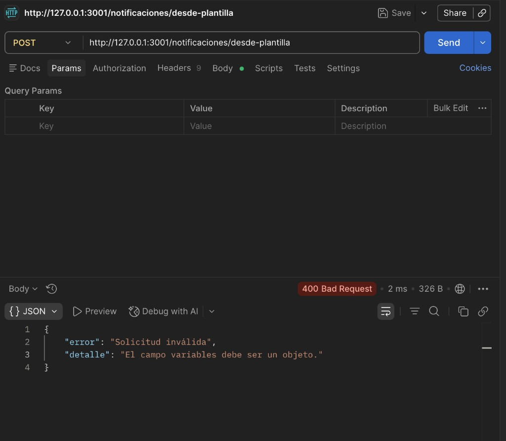

### Anexo A.6 — CP-6 Plantilla inexistente

**Request**

```http
POST http://127.0.0.1:3001/notificaciones/desde-plantilla
Content-Type: application/json

{"destinatario":"prueba@ejemplo.com","idPlantilla":"no_existe_xyz","variables":{}}
```

**Response** `HTTP 404`

```json
{"error":"No existe la plantilla de correo con id \"no_existe_xyz\""}
```

#### Captura Postman (CP-6)

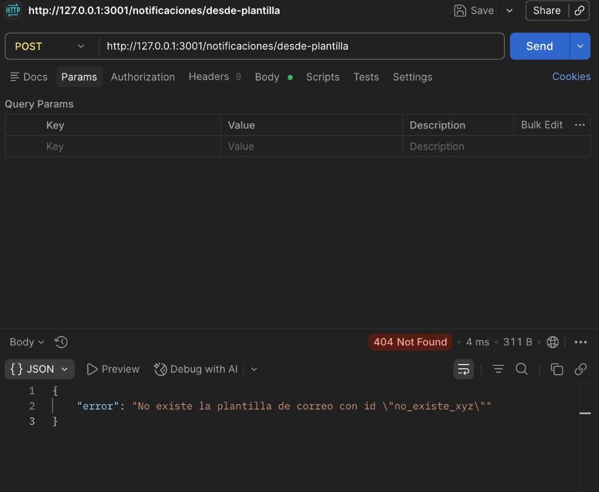

### Anexo A.7 — CP-7 Recordatorio matrícula

**Request**

```http
POST http://127.0.0.1:3001/notificaciones/recordatorio-matricula
Content-Type: application/json

{"nombre":"Johana","plazo":"esta semana"}
```

**Response** `HTTP 202`

```json
{
  "mensaje": "Recordatorio de matrícula enviado (o encolado según el adaptador de correo).",
  "aceptado": true,
  "destinatario": "johannafavorite@gmail.com",
  "idPlantilla": "recordatorio_matricula"
}
```

#### Captura Postman (CP-7)

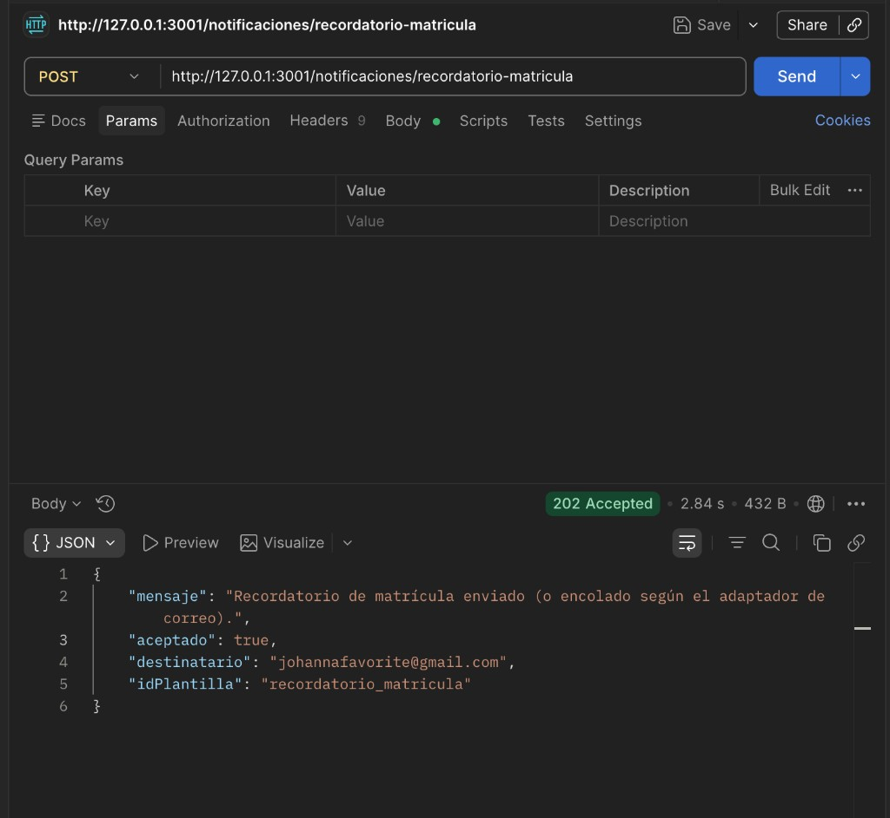

#### Correo recibido (bandeja — MailerSend)

Evidencia de entrega: asunto y cuerpo con plantilla **recordatorio matrícula** (variables `nombre` → **Johana**, `plazo` → **esta semana**). Remitente de prueba MailerSend.

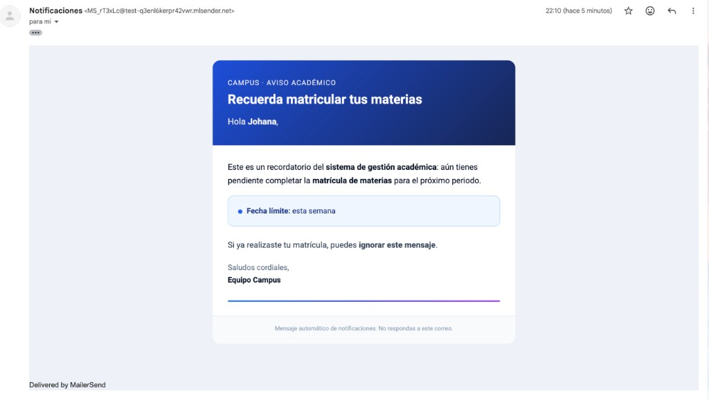

### Anexo A.8 — CP-8 Listar plantillas

**Request**

```http
GET http://127.0.0.1:3001/plantillas-correo
```

**Response** `HTTP 200`

```json
{
  "plantillas": [
    {
      "id": "recordatorio_matricula",
      "descripcion": "Recordatorio de matrícula de materias (prototipo)"
    }
  ]
}
```

#### Captura Postman (CP-8)

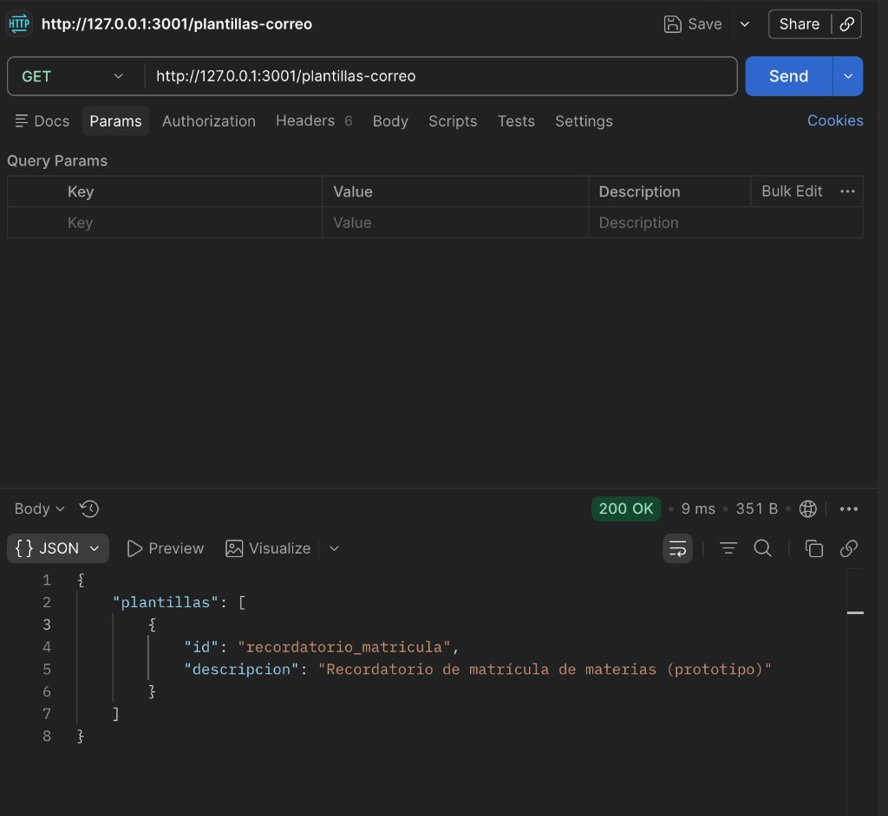

### Anexo A.9 — CP-9 Detalle plantilla (truncado)

**Request**

```http
GET http://127.0.0.1:3001/plantillas-correo/recordatorio_matricula
```

**Response** `HTTP 200` — cuerpo JSON con `plantilla.id`, `descripcion`, `asuntoMarcadores`, `cuerpoMarcadores` y **`cuerpoHtmlMarcadores`** (cadena HTML larga). Para ver la respuesta completa, ejecuta el mismo `curl` y redirige a archivo: `curl -sS ... > docs/evidencias/cp9-detalle.json`.

*(En esta evidencia se omite el HTML completo por tamaño; el campo existió y comenzó por `<!DOCTYPE html>…`.)*

#### Captura Postman (CP-9)

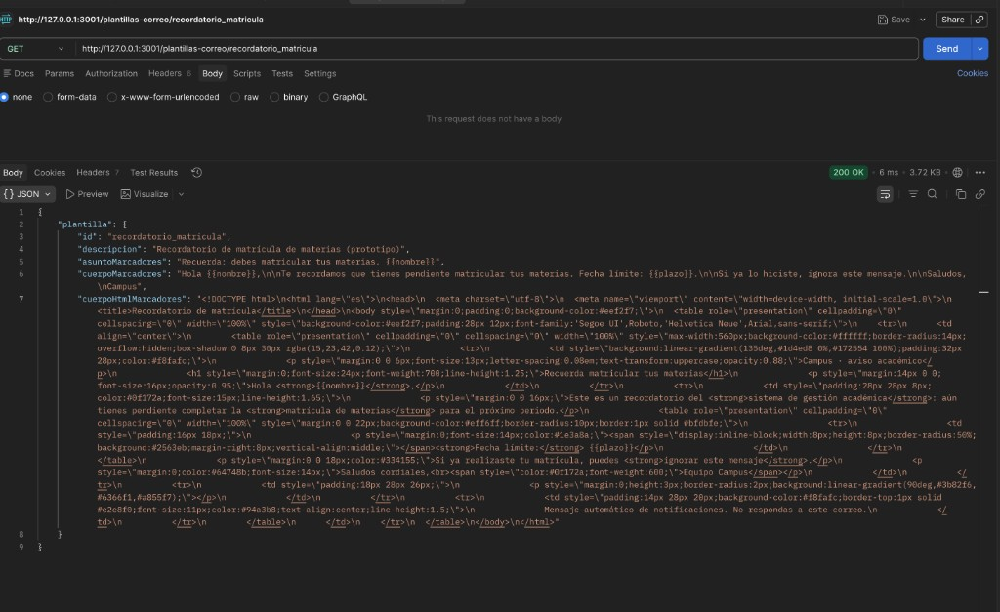

### Anexo A.10 — CP-10 GET plantilla inexistente

**Request**

```http
GET http://127.0.0.1:3001/plantillas-correo/inexistente
```

**Response** `HTTP 404`

```json
{"error":"No existe la plantilla de correo con id \"inexistente\""}
```

#### Captura Postman (CP-10)

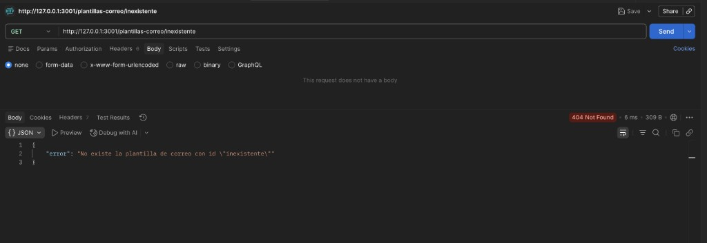

### Anexo A.11 — CP-11 Navegación (secuencia Postman)

Misma sesión de servidor, sin reinicio. Orden documentado:

1. `GET /salud`
2. `GET /plantillas-correo`
3. `POST /notificaciones/recordatorio-matricula` con cuerpo `{"nombre":"Johana","plazo":"esta semana"}`

#### Captura Postman — paso 1

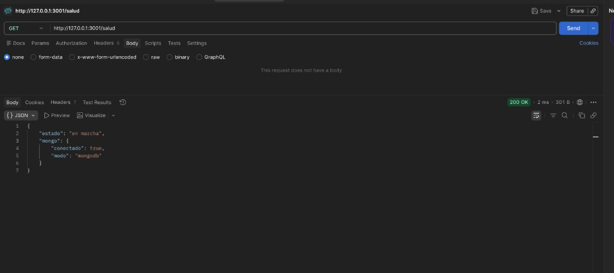

#### Captura Postman — paso 2

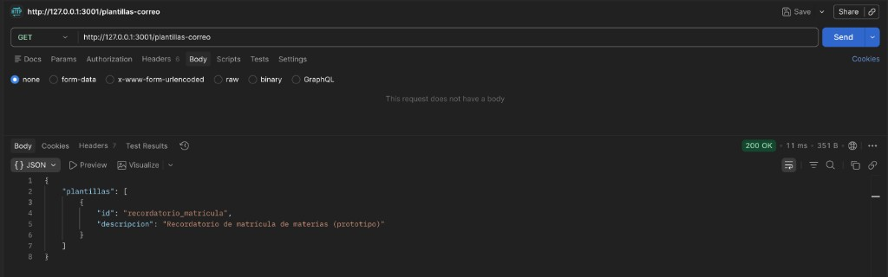

#### Captura Postman — paso 3

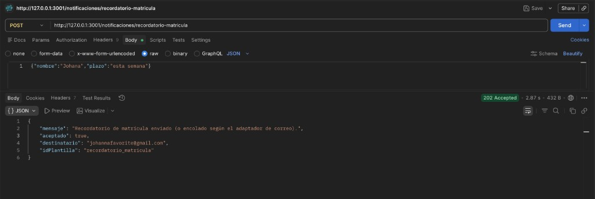

---

<a id="anexo-b"></a>

## Anexo B — Lámina resumen (generada)

Imagen de apoyo que resume la ronda CP-1…CP-11 (no sustituye las capturas Postman ni el Anexo A).

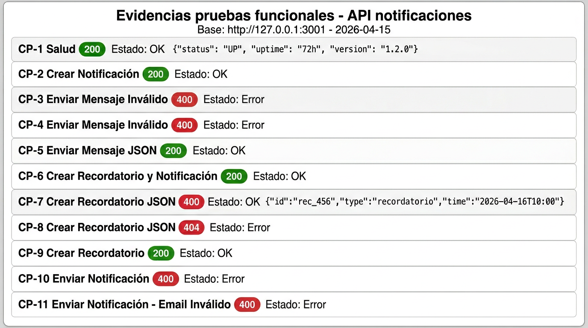

---

## 5. Registro de incidencias (errores detectados)

| ID error | Caso de prueba (ID §4) | Descripción del error | Nivel | Posible causa | Solución aplicada | Estado |
|----------|-------------------------|------------------------|-------|-----------------|-------------------|--------|
| — | — | Ninguna incidencia en esta ronda. | — | — | — | — |

---

## 6. Análisis de resultados

En la ronda documentada, el servicio respondió de forma **coherente** con la arquitectura actual: salud con estado de Mongo, listado y detalle de plantillas alineados con los datos migrados, validaciones **400** en cuerpos inválidos, **404** cuando el id de plantilla no existe, y flujos **202** para envío libre, envío por plantilla existente y recordatorio de matrícula. La secuencia de peticiones se ejecutó **sin reiniciar** el servidor (navegación entre recursos). Las dependencias externas (Mongo y SMTP) estaban operativas en el entorno de prueba. Las **capturas Postman** y la **lámina resumen** quedaron integradas en los **Anexos A y B** de este mismo documento, junto con los request/response textuales.

---

## Referencias

- Arranque y variables: [`.env.example`](../.env.example), [ENTREGAS.md](../ENTREGAS.md).
- Cambios de producto: [CHANGELOG.md](../CHANGELOG.md).
